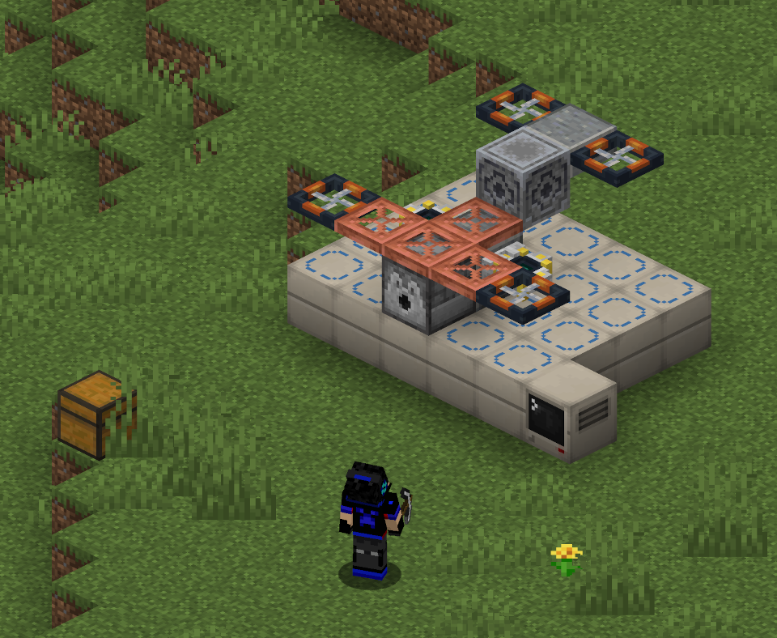

# Modular Drones

Modular Drones lets you build your own personal drone out of regular blocks, then carry it around as a small item. Equip
it, and it'll hover behind you, helping out based on the blocks it's made of — fighting off enemies, mining alongside
you, picking up loot, lighting your way, and more.

## Get started

New to the mod? Head to the **[Getting Started](getting-started.html)** guide to build and equip your first drone.

## Explore further

- **[Abilities Reference](abilities.html)** — every ability a drone can have, the block that enables it, and any special
  placement requirements.
- **[Changes from the Original Mod](changes.html)** — this mod is a fork of rearth's Buddy Drones; this page covers what's
  different.
- **[Changelog](changelog.html)** — a version-by-version history of notable changes since this fork began.
